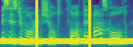

## Guided-TTS: A Diffusion Model for Text-to-Speech via Classifier Guidance (ICML 2022)

<a href="https://arxiv.org/abs/2111.11755">Arxiv</a>

### Authors
- Heeseung Kim (*Equal contribution) <a href="gmltmd789@snu.ac.kr">gmltmd789@snu.ac.kr</a>
- Sungwon Kim (*Equal contribution) <a href="ksw930306@snu.ac.kr">ksw0306@snu.ac.kr</a>
- Sungroh Yoon (Corresponding author) <a href="sryoon@snu.ac.kr">sryoon@snu.ac.kr</a>

### Abstract

We propose Guided-TTS, a high-quality text-to-speech (TTS) model that does not require any transcript of target speaker using classifier guidance. Guided-TTS combines an unconditional diffusion probabilistic model with a separately trained phoneme classifier for classifier guidance. Our unconditional diffusion model learns to generate speech without any context from untranscribed speech data. For TTS synthesis, we guide the generative process of the diffusion model with a phoneme classifier trained on a large-scale speech recognition dataset. We present a norm-based scaling method that reduces the pronunciation errors of classifier guidance in Guided-TTS. We show that Guided-TTS achieves a performance comparable to that of the state-of-the-art TTS model, Grad-TTS, without any transcript for LJSpeech. We further demonstrate that Guided-TTS performs well on diverse datasets including a long-form untranscribed dataset.

### Model Comparison (LJSpeech)

Guided-TTS does NOT use transcript of LJSpeech.

Transcript: Nor did the methods by which they were perpetrated greatly vary from those in times past.
<table>
	<thead>
		<tr>
			<th style="text-align: center">GT</th>
			<th style="text-align: center">GT Mel+HiFi-GAN</th>
			<th style="text-align: center">Guided-TTS</th>
			<th style="text-align: center">Glow-TTS</th>
			<th style="text-align: center">Grad-TTS</th>
		</tr>
	</thead>
	<tbody>
		<tr>
			<td style="text-align: center"><audio controls style="width: 150px;"><source src="wavs/lj_1_gt.wav" type="audio/wav"></audio></td>
			<td style="text-align: center"><audio controls style="width: 150px;"><source src="wavs/lj_1_hifigan.wav" type="audio/wav"></audio></td>
			<td style="text-align: center"><audio controls style="width: 150px;"><source src="wavs/lj_1_guidedtts.wav" type="audio/wav"></audio></td>
			<td style="text-align: center"><audio controls style="width: 150px;"><source src="wavs/lj_1_glowtts.wav" type="audio/wav"></audio></td>
			<td style="text-align: center"><audio controls style="width: 150px;"><source src="wavs/lj_1_gradtts.wav" type="audio/wav"></audio></td>
		</tr>
	</tbody>
</table>

Transcript: He was struck with the appearance of the corpse, which was not emaciated, as after a long disease ending in death;
<table>
	<thead>
		<tr>
			<th style="text-align: center">GT</th>
			<th style="text-align: center">GT Mel+HiFi-GAN</th>
			<th style="text-align: center">Guided-TTS</th>
			<th style="text-align: center">Glow-TTS</th>
			<th style="text-align: center">Grad-TTS</th>
		</tr>
	</thead>
	<tbody>
		<tr>
			<td style="text-align: center"><audio controls style="width: 150px;"><source src="wavs/lj_2_gt.wav" type="audio/wav"></audio></td>
			<td style="text-align: center"><audio controls style="width: 150px;"><source src="wavs/lj_2_hifigan.wav" type="audio/wav"></audio></td>
			<td style="text-align: center"><audio controls style="width: 150px;"><source src="wavs/lj_2_guidedtts.wav" type="audio/wav"></audio></td>
			<td style="text-align: center"><audio controls style="width: 150px;"><source src="wavs/lj_2_glowtts.wav" type="audio/wav"></audio></td>
			<td style="text-align: center"><audio controls style="width: 150px;"><source src="wavs/lj_2_gradtts.wav" type="audio/wav"></audio></td>
		</tr>
	</tbody>
</table>

Transcript: There was unrestrained association of untried and convicted, juvenile with adult prisoners, vagrants, misdemeanants, felons.
<table>
	<thead>
		<tr>
			<th style="text-align: center">GT</th>
			<th style="text-align: center">GT Mel+HiFi-GAN</th>
			<th style="text-align: center">Guided-TTS</th>
			<th style="text-align: center">Glow-TTS</th>
			<th style="text-align: center">Grad-TTS</th>
		</tr>
	</thead>
	<tbody>
		<tr>
			<td style="text-align: center"><audio controls style="width: 150px;"><source src="wavs/lj_3_gt.wav" type="audio/wav"></audio></td>
			<td style="text-align: center"><audio controls style="width: 150px;"><source src="wavs/lj_3_hifigan.wav" type="audio/wav"></audio></td>
			<td style="text-align: center"><audio controls style="width: 150px;"><source src="wavs/lj_3_guidedtts.wav" type="audio/wav"></audio></td>
			<td style="text-align: center"><audio controls style="width: 150px;"><source src="wavs/lj_3_glowtts.wav" type="audio/wav"></audio></td>
			<td style="text-align: center"><audio controls style="width: 150px;"><source src="wavs/lj_3_gradtts.wav" type="audio/wav"></audio></td>
		</tr>
	</tbody>
</table>

### Generalization to Diverse Datasets 

Guided-TTS does NOT use any transcript of untranscribed datasets.
Grad-TTS-ASR: Grad-TTS trained on paired dataset with ASR generated transcript.

1. Untranscribed speech data: LJSpeech

Transcript: Nor did the methods by which they were perpetrated greatly vary from those in times past.
<table>
	<thead>
		<tr>
			<th style="text-align: center">GT</th>
			<th style="text-align: center">GT Mel+HiFi-GAN</th>
			<th style="text-align: center">Guided-TTS</th>
			<th style="text-align: center">Grad-TTS-ASR</th>
		</tr>
	</thead>
	<tbody>
		<tr>
			<td style="text-align: center"><audio controls style="width: 150px;"><source src="wavs/lj_1_gt.wav" type="audio/wav"></audio></td>
			<td style="text-align: center"><audio controls style="width: 150px;"><source src="wavs/lj_1_hifigan.wav" type="audio/wav"></audio></td>
			<td style="text-align: center"><audio controls style="width: 150px;"><source src="wavs/lj_1_guidedtts.wav" type="audio/wav"></audio></td>
			<td style="text-align: center"><audio controls style="width: 150px;"><source src="wavs/lj_1_gradttsasr.wav" type="audio/wav"></audio></td>
		</tr>
	</tbody>
</table>

Transcript: He was struck with the appearance of the corpse, which was not emaciated, as after a long disease ending in death;
<table>
	<thead>
		<tr>
			<th style="text-align: center">GT</th>
			<th style="text-align: center">GT Mel+HiFi-GAN</th>
			<th style="text-align: center">Guided-TTS</th>
			<th style="text-align: center">Grad-TTS-ASR</th>
		</tr>
	</thead>
	<tbody>
		<tr>
			<td style="text-align: center"><audio controls style="width: 150px;"><source src="wavs/lj_2_gt.wav" type="audio/wav"></audio></td>
			<td style="text-align: center"><audio controls style="width: 150px;"><source src="wavs/lj_2_hifigan.wav" type="audio/wav"></audio></td>
			<td style="text-align: center"><audio controls style="width: 150px;"><source src="wavs/lj_2_guidedtts.wav" type="audio/wav"></audio></td>
			<td style="text-align: center"><audio controls style="width: 150px;"><source src="wavs/lj_2_gradttsasr.wav" type="audio/wav"></audio></td>
		</tr>
	</tbody>
</table>

Transcript: There was unrestrained association of untried and convicted, juvenile with adult prisoners, vagrants, misdemeanants, felons.
<table>
	<thead>
		<tr>
			<th style="text-align: center">GT</th>
			<th style="text-align: center">GT Mel+HiFi-GAN</th>
			<th style="text-align: center">Guided-TTS</th>
			<th style="text-align: center">Grad-TTS-ASR</th>
		</tr>
	</thead>
	<tbody>
		<tr>
			<td style="text-align: center"><audio controls style="width: 150px;"><source src="wavs/lj_3_gt.wav" type="audio/wav"></audio></td>
			<td style="text-align: center"><audio controls style="width: 150px;"><source src="wavs/lj_3_hifigan.wav" type="audio/wav"></audio></td>
			<td style="text-align: center"><audio controls style="width: 150px;"><source src="wavs/lj_3_guidedtts.wav" type="audio/wav"></audio></td>
			<td style="text-align: center"><audio controls style="width: 150px;"><source src="wavs/lj_3_gradttsasr.wav" type="audio/wav"></audio></td>
		</tr>
	</tbody>
</table>

2. Untranscribed speech data: Hi-Fi TTS (ID: 92)

Transcript: The other, without flinching, lowered and raised his head slowly.
<table>
	<thead>
		<tr>
			<th style="text-align: center">GT</th>
			<th style="text-align: center">GT Mel+HiFi-GAN</th>
			<th style="text-align: center">Guided-TTS</th>
			<th style="text-align: center">Grad-TTS-ASR</th>
		</tr>
	</thead>
	<tbody>
		<tr>
			<td style="text-align: center"><audio controls style="width: 150px;"><source src="wavs/92_1_gt.wav" type="audio/wav"></audio></td>
			<td style="text-align: center"><audio controls style="width: 150px;"><source src="wavs/92_1_hifigan.wav" type="audio/wav"></audio></td>
			<td style="text-align: center"><audio controls style="width: 150px;"><source src="wavs/92_1_guidedtts.wav" type="audio/wav"></audio></td>
			<td style="text-align: center"><audio controls style="width: 150px;"><source src="wavs/92_1_gradttsasr.wav" type="audio/wav"></audio></td>
		</tr>
	</tbody>
</table>

Transcript: And he repeated, as if reconsidering the suggestion conscientiously:
<table>
	<thead>
		<tr>
			<th style="text-align: center">GT</th>
			<th style="text-align: center">GT Mel+HiFi-GAN</th>
			<th style="text-align: center">Guided-TTS</th>
			<th style="text-align: center">Grad-TTS-ASR</th>
		</tr>
	</thead>
	<tbody>
		<tr>
			<td style="text-align: center"><audio controls style="width: 150px;"><source src="wavs/92_2_gt.wav" type="audio/wav"></audio></td>
			<td style="text-align: center"><audio controls style="width: 150px;"><source src="wavs/92_2_hifigan.wav" type="audio/wav"></audio></td>
			<td style="text-align: center"><audio controls style="width: 150px;"><source src="wavs/92_2_guidedtts.wav" type="audio/wav"></audio></td>
			<td style="text-align: center"><audio controls style="width: 150px;"><source src="wavs/92_2_gradttsasr.wav" type="audio/wav"></audio></td>
		</tr>
	</tbody>
</table>

Transcript: For him the plain duty is to fasten the guilt upon as many prominent anarchists as he can on some slight indications he had picked up in the course of his investigation on the spot;
<table>
	<thead>
		<tr>
			<th style="text-align: center">GT</th>
			<th style="text-align: center">GT Mel+HiFi-GAN</th>
			<th style="text-align: center">Guided-TTS</th>
			<th style="text-align: center">Grad-TTS-ASR</th>
		</tr>
	</thead>
	<tbody>
		<tr>
			<td style="text-align: center"><audio controls style="width: 150px;"><source src="wavs/92_3_gt.wav" type="audio/wav"></audio></td>
			<td style="text-align: center"><audio controls style="width: 150px;"><source src="wavs/92_3_hifigan.wav" type="audio/wav"></audio></td>
			<td style="text-align: center"><audio controls style="width: 150px;"><source src="wavs/92_3_guidedtts.wav" type="audio/wav"></audio></td>
			<td style="text-align: center"><audio controls style="width: 150px;"><source src="wavs/92_3_gradttsasr.wav" type="audio/wav"></audio></td>
		</tr>
	</tbody>
</table>

3. Untranscribed speech data: Hi-Fi TTS (ID: 6097)

Transcript: Any river is deep enough to drown a fool
<table>
	<thead>
		<tr>
			<th style="text-align: center">GT</th>
			<th style="text-align: center">GT Mel+HiFi-GAN</th>
			<th style="text-align: center">Guided-TTS</th>
			<th style="text-align: center">Grad-TTS-ASR</th>
		</tr>
	</thead>
	<tbody>
		<tr>
			<td style="text-align: center"><audio controls style="width: 150px;"><source src="wavs/6097_1_gt.wav" type="audio/wav"></audio></td>
			<td style="text-align: center"><audio controls style="width: 150px;"><source src="wavs/6097_1_hifigan.wav" type="audio/wav"></audio></td>
			<td style="text-align: center"><audio controls style="width: 150px;"><source src="wavs/6097_1_guidedtts.wav" type="audio/wav"></audio></td>
			<td style="text-align: center"><audio controls style="width: 150px;"><source src="wavs/6097_1_gradttsasr.wav" type="audio/wav"></audio></td>
		</tr>
	</tbody>
</table>

Transcript: The plain was grown over with grass, but he could see no tree therein:
<table>
	<thead>
		<tr>
			<th style="text-align: center">GT</th>
			<th style="text-align: center">GT Mel+HiFi-GAN</th>
			<th style="text-align: center">Guided-TTS</th>
			<th style="text-align: center">Grad-TTS-ASR</th>
		</tr>
	</thead>
	<tbody>
		<tr>
			<td style="text-align: center"><audio controls style="width: 150px;"><source src="wavs/6097_2_gt.wav" type="audio/wav"></audio></td>
			<td style="text-align: center"><audio controls style="width: 150px;"><source src="wavs/6097_2_hifigan.wav" type="audio/wav"></audio></td>
			<td style="text-align: center"><audio controls style="width: 150px;"><source src="wavs/6097_2_guidedtts.wav" type="audio/wav"></audio></td>
			<td style="text-align: center"><audio controls style="width: 150px;"><source src="wavs/6097_2_gradttsasr.wav" type="audio/wav"></audio></td>
		</tr>
	</tbody>
</table>

Transcript: The reduction of expense which would result from this appointment would be much more than adequate to the increased expense incurred by the appointment and remuneration of a gentleman of probity and respectability to this office.
<table>
	<thead>
		<tr>
			<th style="text-align: center">GT</th>
			<th style="text-align: center">GT Mel+HiFi-GAN</th>
			<th style="text-align: center">Guided-TTS</th>
			<th style="text-align: center">Grad-TTS-ASR</th>
		</tr>
	</thead>
	<tbody>
		<tr>
			<td style="text-align: center"><audio controls style="width: 150px;"><source src="wavs/6097_3_gt.wav" type="audio/wav"></audio></td>
			<td style="text-align: center"><audio controls style="width: 150px;"><source src="wavs/6097_3_hifigan.wav" type="audio/wav"></audio></td>
			<td style="text-align: center"><audio controls style="width: 150px;"><source src="wavs/6097_3_guidedtts.wav" type="audio/wav"></audio></td>
			<td style="text-align: center"><audio controls style="width: 150px;"><source src="wavs/6097_3_gradttsasr.wav" type="audio/wav"></audio></td>
		</tr>
	</tbody>
</table>

4. Untranscribed speech data: Hi-Fi TTS (ID: 9017)

Transcript: Who is to be master of the world?
<table>
	<thead>
		<tr>
			<th style="text-align: center">GT</th>
			<th style="text-align: center">GT Mel+HiFi-GAN</th>
			<th style="text-align: center">Guided-TTS</th>
			<th style="text-align: center">Grad-TTS-ASR</th>
		</tr>
	</thead>
	<tbody>
		<tr>
			<td style="text-align: center"><audio controls style="width: 150px;"><source src="wavs/9017_1_gt.wav" type="audio/wav"></audio></td>
			<td style="text-align: center"><audio controls style="width: 150px;"><source src="wavs/9017_1_hifigan.wav" type="audio/wav"></audio></td>
			<td style="text-align: center"><audio controls style="width: 150px;"><source src="wavs/9017_1_guidedtts.wav" type="audio/wav"></audio></td>
			<td style="text-align: center"><audio controls style="width: 150px;"><source src="wavs/9017_1_gradttsasr.wav" type="audio/wav"></audio></td>
		</tr>
	</tbody>
</table>

Transcript: The result of these reflections was that d'Artagnan, without asking information of any kind, alighted, commended the horses to the care of his lackey, entered a small room destined to receive those who wished to be alone, and desired the host to bring him a bottle of his best wine and as good a breakfast as possible
<table>
	<thead>
		<tr>
			<th style="text-align: center">GT</th>
			<th style="text-align: center">GT Mel+HiFi-GAN</th>
			<th style="text-align: center">Guided-TTS</th>
			<th style="text-align: center">Grad-TTS-ASR</th>
		</tr>
	</thead>
	<tbody>
		<tr>
			<td style="text-align: center"><audio controls style="width: 150px;"><source src="wavs/9017_2_gt.wav" type="audio/wav"></audio></td>
			<td style="text-align: center"><audio controls style="width: 150px;"><source src="wavs/9017_2_hifigan.wav" type="audio/wav"></audio></td>
			<td style="text-align: center"><audio controls style="width: 150px;"><source src="wavs/9017_2_guidedtts.wav" type="audio/wav"></audio></td>
			<td style="text-align: center"><audio controls style="width: 150px;"><source src="wavs/9017_2_gradttsasr.wav" type="audio/wav"></audio></td>
		</tr>
	</tbody>
</table>

Transcript: No, but I have just met with a terrible adventure!
<table>
	<thead>
		<tr>
			<th style="text-align: center">GT</th>
			<th style="text-align: center">GT Mel+HiFi-GAN</th>
			<th style="text-align: center">Guided-TTS</th>
			<th style="text-align: center">Grad-TTS-ASR</th>
		</tr>
	</thead>
	<tbody>
		<tr>
			<td style="text-align: center"><audio controls style="width: 150px;"><source src="wavs/9017_3_gt.wav" type="audio/wav"></audio></td>
			<td style="text-align: center"><audio controls style="width: 150px;"><source src="wavs/9017_3_hifigan.wav" type="audio/wav"></audio></td>
			<td style="text-align: center"><audio controls style="width: 150px;"><source src="wavs/9017_3_guidedtts.wav" type="audio/wav"></audio></td>
			<td style="text-align: center"><audio controls style="width: 150px;"><source src="wavs/9017_3_gradttsasr.wav" type="audio/wav"></audio></td>
		</tr>
	</tbody>
</table>

5. Untranscribed speech data: Blizzard 2013

Transcript: Crawford's is no common attachment he perseveres, with the hope of creating that regard, which had not been created before.
<table>
	<thead>
		<tr>
			<th style="text-align: center">GT</th>
			<th style="text-align: center">GT Mel+HiFi-GAN</th>
			<th style="text-align: center">Guided-TTS</th>
		</tr>
	</thead>
	<tbody>
		<tr>
			<td style="text-align: center"><audio controls style="width: 150px;"><source src="wavs/blizzard_1_gt.wav" type="audio/wav"></audio></td>
			<td style="text-align: center"><audio controls style="width: 150px;"><source src="wavs/blizzard_1_hifigan.wav" type="audio/wav"></audio></td>
			<td style="text-align: center"><audio controls style="width: 150px;"><source src="wavs/blizzard_1_guidedtts.wav" type="audio/wav"></audio></td>
		</tr>
	</tbody>
</table>

Transcript: He was now the Mister Crawford who was addressing herself with ardent, disinterested love whose feelings were apparently become all that was honorable and upright, whose views of happiness were all fixed on a marriage of attachment who was pouring out his sense of her merits, describing and describing again his affection, proving as far as words could prove it, and in the language, tone, and spirit of a man of talent too, that he sought her for her gentleness, and her goodness.
<table>
	<thead>
		<tr>
			<th style="text-align: center">GT</th>
			<th style="text-align: center">GT Mel+HiFi-GAN</th>
			<th style="text-align: center">Guided-TTS</th>
		</tr>
	</thead>
	<tbody>
		<tr>
			<td style="text-align: center"><audio controls style="width: 150px;"><source src="wavs/blizzard_2_gt.wav" type="audio/wav"></audio></td>
			<td style="text-align: center"><audio controls style="width: 150px;"><source src="wavs/blizzard_2_hifigan.wav" type="audio/wav"></audio></td>
			<td style="text-align: center"><audio controls style="width: 150px;"><source src="wavs/blizzard_2_guidedtts.wav" type="audio/wav"></audio></td>
		</tr>
	</tbody>
</table>

Transcript: There may be some old woman at Thornton Lacey to be converted.
<table>
	<thead>
		<tr>
			<th style="text-align: center">GT</th>
			<th style="text-align: center">GT Mel+HiFi-GAN</th>
			<th style="text-align: center">Guided-TTS</th>
		</tr>
	</thead>
	<tbody>
		<tr>
			<td style="text-align: center"><audio controls style="width: 150px;"><source src="wavs/blizzard_3_gt.wav" type="audio/wav"></audio></td>
			<td style="text-align: center"><audio controls style="width: 150px;"><source src="wavs/blizzard_3_hifigan.wav" type="audio/wav"></audio></td>
			<td style="text-align: center"><audio controls style="width: 150px;"><source src="wavs/blizzard_3_guidedtts.wav" type="audio/wav"></audio></td>
		</tr>
	</tbody>
</table>

### Analysis on the effect of norm-based guidance

<a href=https://arxiv.org/abs/2105.05233>Classifier guidance</a> v.s. Norm-based guidance

Norm-based guidance method with the appropriate gradient scale (s=0.3~0.4) helps accurately generate samples given text sentences. 

Transcript: Nor did the methods by which they were perpetrated greatly vary from those in times past.
<table>
	<thead>
		<tr>
			<th style="text-align: center">Classifier guidance (s=0.5)</th>
			<th style="text-align: center">Classifier guidance (s=1.5)</th>
			<th style="text-align: center">Classifier guidance (s=3.0)</th>
			<th style="text-align: center">Classifier guidance (s=4.5)</th>
			<th style="text-align: center">Norm-based guidance (s=0.1)</th>
			<th style="text-align: center">Norm-based guidance (s=0.3) (Ours)</th>
			<th style="text-align: center">Norm-based guidance (s=0.6)</th>
			<th style="text-align: center">Norm-based guidance (s=1.0)</th>
		</tr>
	</thead>
	<tbody>
		<tr>
			<td style="text-align: center"><audio controls style="width: 150px;"><source src="wavs/lj_1_classifier_guidance_s05.wav" type="audio/wav"></audio></td>
			<td style="text-align: center"><audio controls style="width: 150px;"><source src="wavs/lj_1_classifier_guidance_s15.wav" type="audio/wav"></audio></td>
			<td style="text-align: center"><audio controls style="width: 150px;"><source src="wavs/lj_1_classifier_guidance_s30.wav" type="audio/wav"></audio></td>
			<td style="text-align: center"><audio controls style="width: 150px;"><source src="wavs/lj_1_classifier_guidance_s45.wav" type="audio/wav"></audio></td>
			<td style="text-align: center"><audio controls style="width: 150px;"><source src="wavs/lj_1_norm_guidance_s01.wav" type="audio/wav"></audio></td>
			<td style="text-align: center"><audio controls style="width: 150px;"><source src="wavs/lj_1_guidedtts.wav" type="audio/wav"></audio></td>
			<td style="text-align: center"><audio controls style="width: 150px;"><source src="wavs/lj_1_norm_guidance_s06.wav" type="audio/wav"></audio></td>
			<td style="text-align: center"><audio controls style="width: 150px;"><source src="wavs/lj_1_norm_guidance_s10.wav" type="audio/wav"></audio></td>
		</tr>
	</tbody>
</table>

Transcript: There was unrestrained association of untried and convicted, juvenile with adult prisoners, vagrants, misdemeanants, felons.
<table>
	<thead>
		<tr>
			<th style="text-align: center">Classifier guidance (s=0.5)</th>
			<th style="text-align: center">Classifier guidance (s=1.5)</th>
			<th style="text-align: center">Classifier guidance (s=3.0)</th>
			<th style="text-align: center">Classifier guidance (s=4.5)</th>
			<th style="text-align: center">Norm-based guidance (s=0.1)</th>
			<th style="text-align: center">Norm-based guidance (s=0.3) (Ours)</th>
			<th style="text-align: center">Norm-based guidance (s=0.6)</th>
			<th style="text-align: center">Norm-based guidance (s=1.0)</th>
		</tr>
	</thead>
	<tbody>
		<tr>
			<td style="text-align: center"><audio controls style="width: 150px;"><source src="wavs/lj_3_classifier_guidance_s05.wav" type="audio/wav"></audio></td>
			<td style="text-align: center"><audio controls style="width: 150px;"><source src="wavs/lj_3_classifier_guidance_s15.wav" type="audio/wav"></audio></td>
			<td style="text-align: center"><audio controls style="width: 150px;"><source src="wavs/lj_3_classifier_guidance_s30.wav" type="audio/wav"></audio></td>
			<td style="text-align: center"><audio controls style="width: 150px;"><source src="wavs/lj_3_classifier_guidance_s45.wav" type="audio/wav"></audio></td>
			<td style="text-align: center"><audio controls style="width: 150px;"><source src="wavs/lj_3_norm_guidance_s01.wav" type="audio/wav"></audio></td>
			<td style="text-align: center"><audio controls style="width: 150px;"><source src="wavs/lj_3_guidedtts.wav" type="audio/wav"></audio></td>
			<td style="text-align: center"><audio controls style="width: 150px;"><source src="wavs/lj_3_norm_guidance_s06.wav" type="audio/wav"></audio></td>
			<td style="text-align: center"><audio controls style="width: 150px;"><source src="wavs/lj_3_norm_guidance_s10.wav" type="audio/wav"></audio></td>
		</tr>
	</tbody>
</table>

### Unconditional Generation

<table>
	<thead>
		<tr>
			<th style="text-align: center">Unconditional DDPM (LJSpeech)</th>
			<th style="text-align: center">Unconditional DDPM (Hi-Fi TTS ID: 92)</th>
			<th style="text-align: center">Unconditional DDPM (Hi-Fi TTS ID: 6097)</th>
		</tr>
	</thead>
	<tbody>
		<tr>
			<td style="text-align: center"><audio controls style="width: 150px;"><source src="wavs/lj_uncon.wav" type="audio/wav"></audio></td>
			<td style="text-align: center"><audio controls style="width: 150px;"><source src="wavs/92_uncon.wav" type="audio/wav"></audio></td>
			<td style="text-align: center"><audio controls style="width: 150px;"><source src="wavs/6097_uncon.wav" type="audio/wav"></audio></td>
		</tr>
	</tbody>
</table>

### Mel-spectrogram Inpainting Results

<table>
	<thead>
		<tr>
			<th style="text-align: center">Dataset</th>
			<th style="text-align: center">LJSpeech</th>
			<th style="text-align: center">Hi-Fi TTS ID: 92</th>
			<th style="text-align: center">Hi-Fi TTS ID: 6097</th>
		</tr>
	</thead>
	<tbody>
		<tr>
			<td style="text-align: center">Mel-spectrogram</td>
			<td style="text-align: center"></td>
			<td style="text-align: center"></td>
			<td style="text-align: center"></td>
		</tr>
	</tbody>
	<tbody>
		<tr>
			<td style="text-align: center">Ground Truth</td>
			<td style="text-align: center"><audio controls style="width: 150px;"><source src="wavs/lj_inpainting_gt.wav" type="audio/wav"></audio></td>
			<td style="text-align: center"><audio controls style="width: 150px;"><source src="wavs/92_inpainting_gt.wav" type="audio/wav"></audio></td>
			<td style="text-align: center"><audio controls style="width: 150px;"><source src="wavs/6097_inpainting_gt.wav" type="audio/wav"></audio></td>
		</tr>
	</tbody>
	<tbody>
		<tr>
			<td style="text-align: center">Inpainting</td>
			<td style="text-align: center"><audio controls style="width: 150px;"><source src="wavs/lj_inpainting_model.wav" type="audio/wav"></audio></td>
			<td style="text-align: center"><audio controls style="width: 150px;"><source src="wavs/92_inpainting_model.wav" type="audio/wav"></audio></td>
			<td style="text-align: center"><audio controls style="width: 150px;"><source src="wavs/6097_inpainting_model.wav" type="audio/wav"></audio></td>
		</tr>
	</tbody>
</table>
